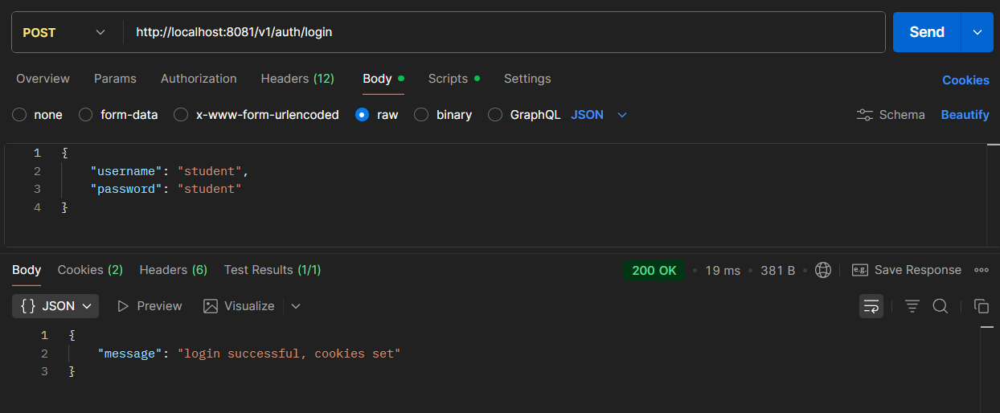
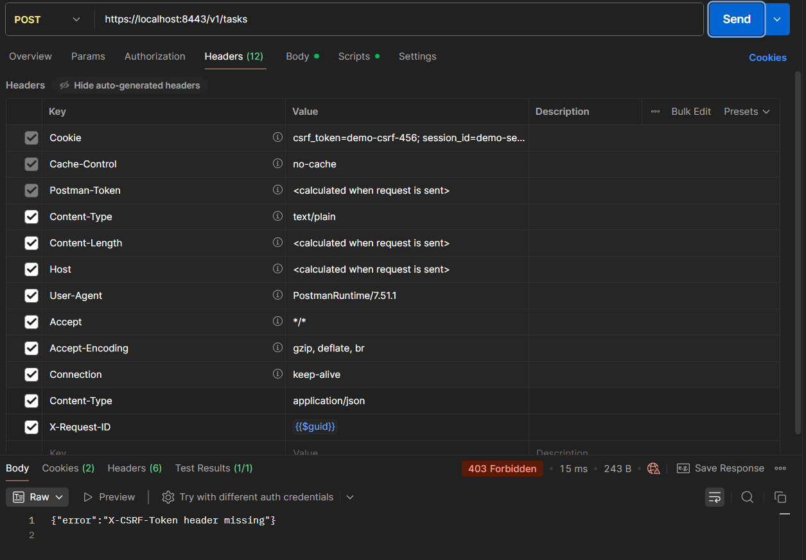
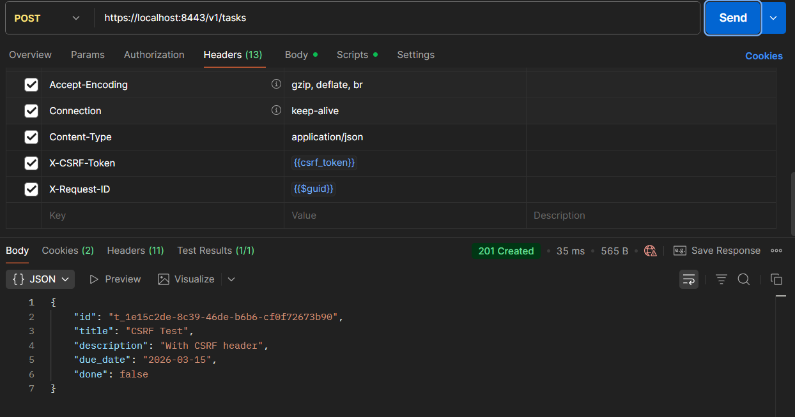
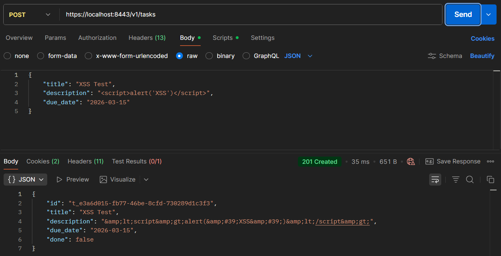
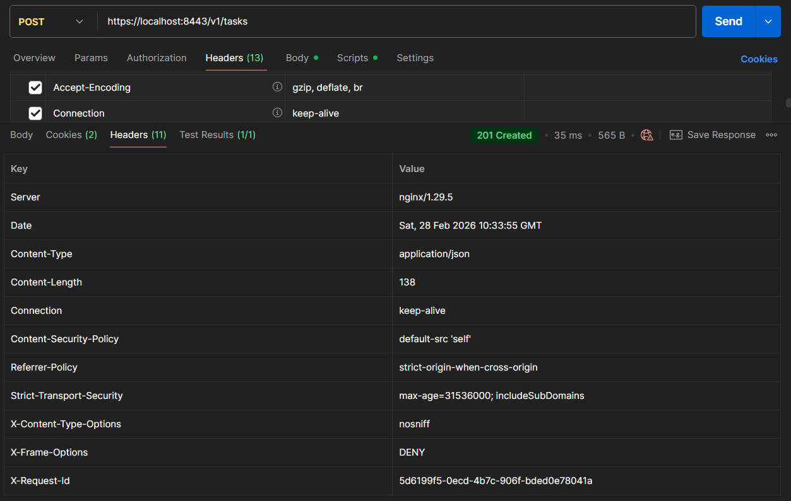
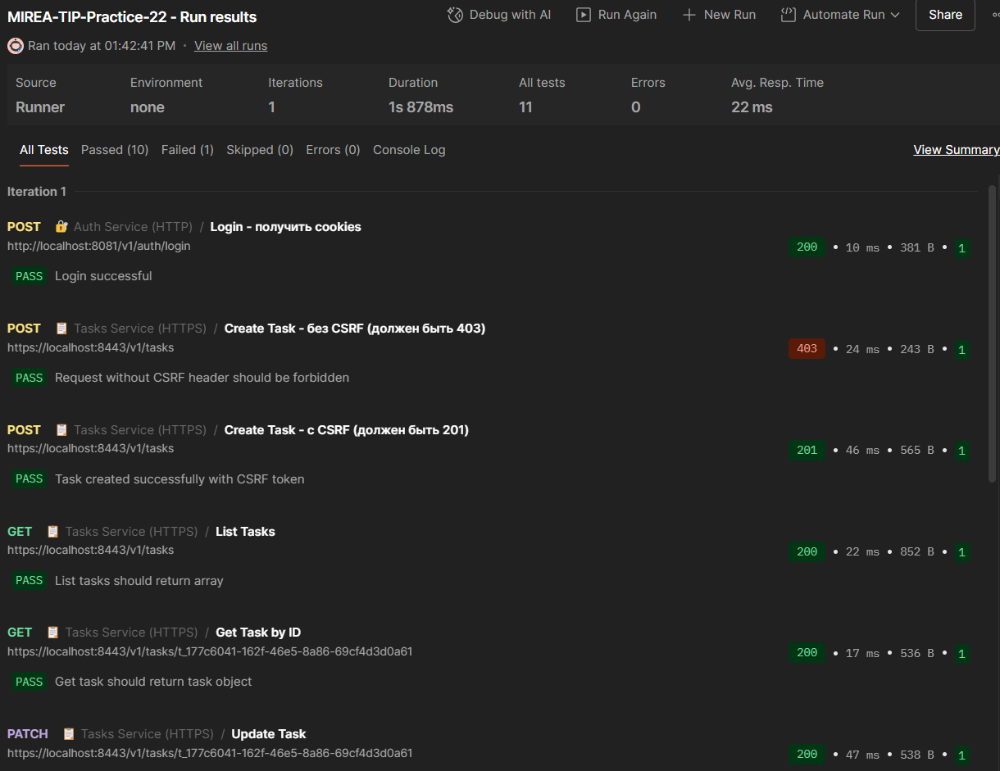
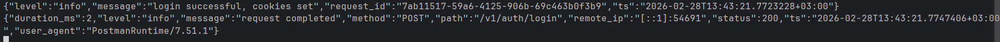
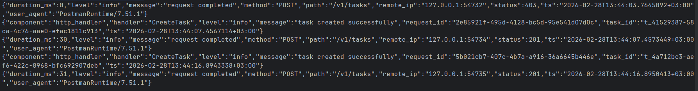

# Практическое занятие №6 (22). Реализация защиты от CSRF/XSS. Работа с secure cookies

## Выполнил: Туев Д. ЭФМО-01-25

## Содержание

1. [Описание проекта](#описание-проекта)
2. [Реализация secure cookies](#реализация-secure-cookies)
3. [CSRF защита (Double Submit Cookie)](#csrf-защита-double-submit-cookie)
4. [Защита от XSS](#защита-от-xss)
5. [Заголовки безопасности](#заголовки-безопасности)
6. [Структура проекта](#структура-проекта)
7. [Запуск сервисов](#запуск-сервисов)
8. [Скриншоты выполнения](#скриншоты-выполнения)
9. [Выводы](#выводы)
10. [Контрольные вопросы](#контрольные-вопросы)

---

## Описание проекта

В рамках практического занятия №22 на базе сервисов **Auth** и **Tasks** из предыдущих работ реализованы механизмы защиты от браузерных угроз:

1. **Secure cookies** — установка флагов HttpOnly, Secure, SameSite для предотвращения кражи cookies и CSRF-атак.
2. **CSRF защита** — реализация подхода Double Submit Cookie для защиты state-changing запросов.
3. **Защита от XSS** — санитизация пользовательского ввода для предотвращения внедрения скриптов.
4. **Заголовки безопасности** — добавление HSTS, CSP, X-Frame-Options и других защитных заголовков.

**Архитектура решения:**
- **Auth service** — HTTP сервер (порт 8081) для выдачи cookies после логина, а также gRPC сервер (порт 50051) для проверки токенов (обратная совместимость).
- **Tasks service** — HTTP REST API (порт 8082, доступ через HTTPS на 8443) для работы с задачами, использующий cookies для аутентификации и CSRF-защиты.
- **PostgreSQL** — база данных для хранения задач (в Docker).
- **NGINX** — reverse proxy с TLS-терминацией (порт 8443).

---

## Реализация secure cookies

### Cookies, устанавливаемые при логине

| Cookie | Значение | HttpOnly | Secure | SameSite | Max-Age | Назначение |
|--------|----------|----------|--------|----------|---------|------------|
| `session_id` | `demo-session-123` | ✅ Да | ✅ Да | Lax | 3600 | Идентификатор сессии (аутентификация) |
| `csrf_token` | `demo-csrf-456` | ❌ Нет | ✅ Да | Lax | 3600 | Токен для CSRF-защиты (читается JS) |

### Код установки cookies в Auth service

```go
// Установка session cookie (HttpOnly, Secure, SameSite=Lax)
http.SetCookie(w, &http.Cookie{
    Name:     "session_id",
    Value:    sessionID,
    Path:     "/",
    HttpOnly: true,
    Secure:   true,
    SameSite: http.SameSiteLaxMode,
    MaxAge:   3600,
})

// Установка CSRF cookie (НЕ HttpOnly, чтобы JS мог прочитать)
http.SetCookie(w, &http.Cookie{
    Name:     "csrf_token",
    Value:    csrfToken,
    Path:     "/",
    HttpOnly: false,
    Secure:   true,
    SameSite: http.SameSiteLaxMode,
    MaxAge:   3600,
})
```

### Обоснование выбора флагов

- **HttpOnly для session_id** — защищает от кражи сессии через XSS, так как JavaScript не может прочитать эту cookie.
- **Нет HttpOnly для csrf_token** — требуется, чтобы фронтенд мог прочитать токен и отправить его в заголовке `X-CSRF-Token`.
- **Secure для обоих** — cookies передаются только по HTTPS, защита от перехвата в открытых сетях.
- **SameSite=Lax** — баланс между безопасностью и удобством: cookies отправляются при навигации на сайт, но не при кросс-доменных POST-запросах.

---

## CSRF защита (Double Submit Cookie)

### Принцип работы

1. **Сервер** (Auth) при логине устанавливает две cookies:
    - `session_id` (HttpOnly) — для аутентификации
    - `csrf_token` (без HttpOnly) — для CSRF-защиты
2. **Клиент** (фронтенд) читает `csrf_token` из cookies и добавляет его в заголовок `X-CSRF-Token` при каждом state-changing запросе (POST, PATCH, DELETE).
3. **Сервер** (Tasks) в middleware сравнивает значение из cookie и заголовка:
    - Если совпадают — запрос разрешён
    - Если нет или отсутствуют — 403 Forbidden

### Middleware для CSRF

```go
func CSRFMiddleware(next http.Handler) http.Handler {
    return http.HandlerFunc(func(w http.ResponseWriter, r *http.Request) {
        if r.Method == http.MethodPost || r.Method == http.MethodPatch || r.Method == http.MethodDelete {
            csrfCookie, err := r.Cookie("csrf_token")
            if err != nil {
                http.Error(w, `{"error":"CSRF token missing in cookies"}`, http.StatusForbidden)
                return
            }

            csrfHeader := r.Header.Get("X-CSRF-Token")
            if csrfHeader == "" {
                http.Error(w, `{"error":"X-CSRF-Token header missing"}`, http.StatusForbidden)
                return
            }

            if csrfCookie.Value != csrfHeader {
                http.Error(w, `{"error":"CSRF token mismatch"}`, http.StatusForbidden)
                return
            }
        }
        next.ServeHTTP(w, r)
    })
}
```

### Почему это работает?

- Вредоносный сайт может заставить браузер отправить cookies (включая `csrf_token`), но **не может прочитать их** из-за Same-origin policy.
- Без значения `csrf_token` злоумышленник не может сформировать корректный заголовок `X-CSRF-Token`.
- Даже если вредоносный сайт как-то узнает токен, атака невозможна, так как токен привязан к домену.

---

## Защита от XSS

### Санитизация ввода

Для предотвращения XSS-атак все пользовательские строковые поля (`title`, `description`, поисковый запрос `q`) проходят через функцию санитизации, заменяющую опасные символы на HTML-сущности:

```go
func sanitizeInput(input string) string {
    replacer := strings.NewReplacer(
        "<", "&lt;",
        ">", "&gt;",
        "&", "&amp;",
        "\"", "&quot;",
        "'", "&#39;",
    )
    return replacer.Replace(input)
}
```

Пример работы:
- Ввод: `<script>alert('XSS')</script>`
- Вывод: `&lt;script&gt;alert(&#39;XSS&#39;)&lt;/script&gt;`

### Где применяется санитизация

- В `CreateTask` — для `title` и `description`
- В `UpdateTask` — для `description` (если передано)
- В `SearchTasks` — для поискового запроса `q` (дополнительная защита)

---

## Заголовки безопасности

Middleware `SecurityHeadersMiddleware` добавляет к каждому ответу следующие заголовки:

| Заголовок | Значение | Назначение |
|-----------|----------|------------|
| `X-Content-Type-Options` | `nosniff` | Запрещает браузеру угадывать MIME-тип |
| `X-Frame-Options` | `DENY` | Защита от clickjacking |
| `Content-Security-Policy` | `default-src 'self'` | Ограничивает источники загрузки ресурсов |
| `Referrer-Policy` | `strict-origin-when-cross-origin` | Контролирует передачу Referrer |
| `Strict-Transport-Security` | `max-age=31536000; includeSubDomains` | HSTS — требует HTTPS |

### Код middleware

```go
func SecurityHeadersMiddleware(next http.Handler) http.Handler {
    return http.HandlerFunc(func(w http.ResponseWriter, r *http.Request) {
        w.Header().Set("X-Content-Type-Options", "nosniff")
        w.Header().Set("X-Frame-Options", "DENY")
        w.Header().Set("Content-Security-Policy", "default-src 'self'")
        w.Header().Set("Referrer-Policy", "strict-origin-when-cross-origin")
        w.Header().Set("Strict-Transport-Security", "max-age=31536000; includeSubDomains")
        next.ServeHTTP(w, r)
    })
}
```

---

## Структура проекта

```
MIREA-TIP-Practice-22/
├── tech-ip-sem2/
│   ├── deploy/
│   │   ├── migrations/
│   │   ├── monitoring/          # Prometheus + Grafana (ПЗ №20)
│   │   └── tls/                  # HTTPS конфигурация
│   │       ├── cert.pem
│   │       ├── docker-compose.yml
│   │       ├── nginx.conf
│   │       └── ...
│   ├── proto/                     # gRPC контракты
│   ├── scripts/
│   │   └── test_csrf.ps1          # Скрипт для демо CSRF/XSS
│   ├── services/
│   │   ├── auth/                   # Auth service
│   │   │   ├── cmd/
│   │   │   ├── internal/
│   │   │   │   ├── http/
│   │   │   │   │   └── handlers.go  # LoginHandler с установкой cookies
│   │   │   │   └── service/
│   │   │   └── ...
│   │   └── tasks/                   # Tasks service
│   │       ├── cmd/
│   │       ├── internal/
│   │       │   ├── http/
│   │       │   │   └── handlers.go  # verifySession, санитизация
│   │       │   ├── middleware/
│   │       │   │   ├── csrf.go       # CSRF middleware
│   │       │   │   └── security_headers.go
│   │       │   └── service/
│   │       │       └── tasks.go      # Санитизация
│   │       └── ...
│   └── shared/                      # Общий код
└── MIREA-TIP-Practice-22.iml
```

---

## Запуск сервисов

### 1. Запуск PostgreSQL и NGINX

```powershell
cd tech-ip-sem2/deploy/tls
docker-compose up -d
```

### 2. Запуск Auth service

```powershell
cd services/auth
$env:AUTH_HTTP_PORT="8081"
$env:AUTH_GRPC_PORT="50051"
go run ./cmd/auth
```

### 3. Запуск Tasks service

```powershell
cd services/tasks
$env:TASKS_PORT="8082"
$env:AUTH_GRPC_ADDR="localhost:50051"
$env:DB_HOST="localhost"
$env:DB_PORT="5432"
$env:DB_USER="tasks_user"
$env:DB_PASSWORD="tasks_pass"
$env:DB_NAME="tasks_db"
$env:DB_DRIVER="postgres"
go run ./cmd/tasks
```

### 4. Запуск тестового скрипта

```powershell
cd scripts
.\test_csrf.ps1
```

---

## Скриншоты выполнения

### 1. Логин и получение cookies



### 2. Cookies в браузере/Postman


### 3. Попытка создания задачи без CSRF-токена



### 4. Успешное создание задачи с CSRF-токеном



### 5. Демонстрация XSS-защиты (санитизация)



### 6. Заголовки безопасности в ответе



### 7. Запуск тестового скрипта test_csrf.ps1


### 8. Postman коллекция



### 9. Логи Auth service при логине



### 10. Логи Tasks service с CSRF-проверками



---


## Выводы

В ходе выполнения практического занятия №22 были достигнуты следующие результаты:

### Secure cookies
1. **Реализована выдача двух cookies** при логине: `session_id` (HttpOnly) и `csrf_token` (без HttpOnly).
2. **Установлены правильные флаги**:
    - `HttpOnly` для защиты от XSS-кражи сессии
    - `Secure` для передачи только по HTTPS
    - `SameSite=Lax` для баланса безопасности и удобства
    - `Max-Age=3600` для ограничения времени жизни

### CSRF защита
1. **Реализован подход Double Submit Cookie** — токен передаётся и в cookie, и в заголовке.
2. **Создано middleware `CSRFMiddleware`**, проверяющее совпадение токенов для всех state-changing методов (POST, PATCH, DELETE).
3. **Настроена правильная цепочка middleware**: request-id → security headers → CSRF → метрики → логирование.
4. **Проведено тестирование**: запросы без CSRF-токена возвращают 403, с корректным токеном — 200/201.

### Защита от XSS
1. **Реализована санитизация ввода** через функцию `sanitizeInput`, заменяющую опасные символы на HTML-сущности.
2. **Санитизация применяется** ко всем пользовательским строковым полям (`title`, `description`, поисковый запрос).
3. **Демонстрация**: попытка внедрить `<script>` приводит к сохранению безопасной строки `&lt;script&gt;`.

### Заголовки безопасности
1. **Создано middleware `SecurityHeadersMiddleware`**, добавляющее 5 ключевых заголовков безопасности.
2. **Проверено наличие** заголовков во всех ответах.

### Общие результаты
- Система полностью защищена от CSRF-атак.
- Ввод пользователя санитизируется, предотвращая XSS.
- Cookies настроены с оптимальными флагами безопасности.
- Добавлены заголовки безопасности для защиты браузера.
- Сохранена обратная совместимость с предыдущими работами (HTTPS, логирование, метрики).

Таким образом, сервис приобрёл базовые механизмы защиты от распространённых веб-уязвимостей, что необходимо для эксплуатации в реальных условиях.

---

## Контрольные вопросы

### 1. Почему CSRF возможен при использовании cookies?

CSRF (Cross-Site Request Forgery) возможен потому, что браузер автоматически прикрепляет cookies к запросам на целевой домен, даже если запрос инициирован с другого сайта. Например, если пользователь авторизован на сайте `bank.com`, и посещает вредоносный сайт, тот может отправить POST-запрос на `bank.com/transfer`, и браузер автоматически добавит cookies сессии. Сервер не может отличить легитимный запрос от поддельного.

### 2. Что делает флаг SameSite и какие есть режимы?

`SameSite` ограничивает отправку cookies при кросс-сайтовых запросах. Режимы:
- **Strict** — cookie не отправляется ни при каких кросс-сайтовых запросах (максимальная безопасность, но может ломать UX).
- **Lax** — cookie отправляется при навигации верхнего уровня (переход по ссылке), но не при POST-запросах с других сайтов. Рекомендуется по умолчанию.
- **None** — cookie отправляется всегда, но требует флага Secure. Используется, когда нужно third-party поведение.

### 3. Чем HttpOnly защищает от XSS и почему он не "лечит" XSS полностью?

`HttpOnly` запрещает JavaScript доступ к cookie. Это защищает от кражи сессии через XSS-уязвимость: даже если злоумышленник внедрит скрипт, он не сможет прочитать `session_id`.

Однако `HttpOnly` не лечит XSS полностью, потому что:
- XSS может использоваться не только для кражи cookies, но и для выполнения других действий (подделка запросов, кража данных с страницы, перенаправление).
- Если XSS присутствует, злоумышленник может отправлять запросы от имени пользователя, даже не зная содержимого HttpOnly cookie (браузер отправит их автоматически).

### 4. Почему Secure обязателен, если cookie несёт сессию?

Флаг `Secure` требует, чтобы cookie отправлялась только по HTTPS. Для сессионных cookies это обязательно, потому что:
- Без HTTPS cookie передаётся в открытом виде и может быть перехвачена в общественных Wi-Fi сетях (атака man-in-the-middle).
- Перехваченная сессионная cookie позволяет злоумышленнику полностью захватить учётную запись пользователя.
- Современные браузеры могут даже не устанавливать cookie без Secure, если сайт работает через HTTPS.

### 5. Как работает double-submit CSRF защита?

Double Submit Cookie работает следующим образом:
1. Сервер устанавливает две cookies: сессионную (HttpOnly) и CSRF-токен (без HttpOnly).
2. Клиент (JavaScript) читает CSRF-токен из cookie и добавляет его в заголовок `X-CSRF-Token` при каждом опасном запросе.
3. Сервер при получении запроса сравнивает значение CSRF-токена из cookie и из заголовка.
4. Если значения совпадают — запрос легитимен, если нет или отсутствуют — 403.

Атака невозможна, потому что:
- Вредоносный сайт не может прочитать CSRF-токен из cookie другого домена (Same-origin policy).
- Без значения токена нельзя сформировать корректный заголовок.

### 6. Что такое XSS и какие базовые меры защиты применимы на backend?

XSS (Cross-Site Scripting) — это внедрение вредоносного скрипта в веб-страницу, который выполняется в браузере жертвы. XSS бывает:
- **Отражённый** — скрипт передаётся в запросе и сразу отображается в ответе.
- **Хранимый** — скрипт сохраняется на сервере (например, в БД) и отображается при загрузке страницы.
- **DOM-based** — уязвимость на стороне клиента.

**Базовые меры защиты на backend:**
1. **Санитизация ввода** — удаление или экранирование опасных символов (`<`, `>`, `&`, `"`, `'`).
2. **Экранирование вывода** — при вставке пользовательского контента в HTML/JSON использовать соответствующие функции экранирования.
3. **Заголовки безопасности** — `Content-Security-Policy`, `X-XSS-Protection`.
4. **HttpOnly cookies** — защита от кражи сессии.
5. **Валидация формата** — например, для поля email проверять, что это действительно email, а не скрипт.

---

## Приложение: Postman коллекция

В репозитории доступна [Postman коллекция](https://www.postman.com/lively-flare-564043/workspace/learning/collection/42992055-7f3f3f0a-a630-45fb-9d6a-dbeb0dc6b679?action=share&source=copy-link&creator=42992055) со следующими группами запросов:

- **Auth Service (HTTP)** — логин для получения cookies
- **Tasks Service (HTTPS)** — CRUD-операции с CSRF-защитой
- **XSS Protection Demo** — демонстрация санитизации
- **SQL Injection Demo** — наследие из ПЗ21
- **Security Headers Check** — проверка заголовков

**Важно:** При использовании Postman необходимо отключить проверку SSL-сертификатов (Settings → SSL certificate verification → OFF).

Коллекция включает автоматические тесты, проверяющие статусы ответов и наличие необходимых заголовков.
